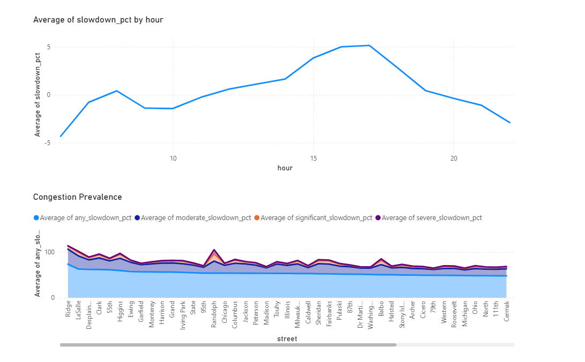

# Chicago Traffic Congestion Prioritization Analysis

## Project Overview

This project analyzes traffic congestion across Chicago roadway segments using the **City of Chicago Traffic Tracker** dataset. The objective is to develop a data-driven framework for identifying roadway segments that should be prioritized for congestion mitigation.

Rather than relying solely on raw traffic speeds, this analysis establishes a **segment-specific baseline speed** and measures congestion relative to each roadway segment's normal operating conditions. A composite **Priority Score** is then calculated by combining congestion severity and recurrence to rank roadway segments based on operational impact.

---

## Business Problem

Transportation agencies have limited resources for roadway improvements. Identifying where congestion consistently occurs is essential for prioritizing infrastructure investments and operational improvements.

This project answers the question:

> **Which roadway segments should be prioritized for congestion mitigation based on both the severity and recurrence of traffic slowdowns?**

---

## Dataset

**Source:** Chicago Traffic Tracker

**Analysis Period:**
- June 11, 2024 – December 31, 2024

The dataset includes hourly traffic observations for roadway segments throughout Chicago, including:

- Segment ID
- Street Name
- Date and Hour
- Average Speed (mph)
- Data Quality Classification

---

## Tools & Technologies

| Tool | Purpose |
|------|---------|
| Python | Data acquisition and preprocessing |
| DuckDB SQL | Data cleaning, transformation, and analysis |
| Jupyter Notebook | End-to-end analytical workflow |
| Power BI *(In Progress)* | Interactive dashboard and visualization |

---

# Methodology

## 1. Data Cleaning

The raw traffic data was cleaned by:

- Filtering to High Quality observations
- Standardizing timestamps
- Removing invalid records

Output:

- `traffic_clean`

---

## 2. Baseline Speed Calculation

Each roadway segment operates under different normal traffic conditions.

To account for these differences, a baseline operating speed was calculated individually for every roadway segment using weekday observations between **10:00 AM and 1:00 PM**, representing relatively uncongested conditions.

Output:

- `baseline`

---

## 3. Slowdown Analysis

Traffic congestion was measured relative to each roadway segment's baseline speed.

**Formula**

```
Slowdown (%) =
(Baseline Speed − Observed Speed)
÷ Baseline Speed × 100
```

Output:

- `slowdown`

---

## 4. Segment-Level Summary

Traffic observations were aggregated by roadway segment to calculate:

- Average slowdown (%)
- Percentage of significant slowdowns (≥20%)
- Observation count

Output:

- `segment_summary`

---

## 5. Priority Ranking

Both congestion metrics were normalized using **Min-Max Normalization**.

The final Priority Score equally weights:

- Congestion Severity
- Congestion Frequency

**Priority Score**

```
Priority Score =
0.5 × Severity Score
+
0.5 × Frequency Score
```

Roadway segments are then ranked from highest to lowest priority.

Output:

- `priority_ranking`

---

# Project Workflow

```text
Raw Traffic Data
        │
        ▼
Data Cleaning
        │
        ▼
Baseline Speed
        │
        ▼
Slowdown Analysis
        │
        ▼
Segment Summary
        │
        ▼
Priority Ranking
        │
        ▼
Power BI Dashboard
```

---

# Key Findings

- Afternoon traffic congestion peaks during the **4–5 PM** commute period.
- Measuring congestion relative to each roadway segment's baseline provides a more meaningful comparison than using raw traffic speeds.
- Combining congestion severity with the frequency of recurring slowdowns identifies roadway segments that consistently experience operational challenges.
- The Priority Score provides a transparent and repeatable framework for identifying roadway segments that may benefit from congestion mitigation strategies.

---

# Repository Structure

```
Chicago-Traffic-Congestion-Analysis/

│── README.md
│── Chicago_Traffic_Congestion_Analysis.ipynb

├── data/
│     ├── priority_ranking.csv
│     ├── segment_summary.csv
│     └── slowdown.csv

├── dashboard/
│     └── Chicago_Traffic_Dashboard.pbix

├── images/
│     ├── dashboard_overview.png
│     ├── dashboard_priority.png
│     └── dashboard_hourly.png
```

---

# Dashboard Preview

> *(Dashboard screenshots will be added after the Power BI dashboard is completed.)*

## Executive Overview


---

## Priority Ranking


---

## Hourly Congestion Analysis



---

# Skills Demonstrated

### SQL

- Common Table Expressions (CTEs)
- Window Functions
- Views
- Aggregations
- Ranking Functions
- Min-Max Normalization
- Conditional Logic
- Data Cleaning

### Data Analytics

- Feature Engineering
- Baseline Development
- Congestion Analysis
- KPI Development
- Composite Scoring Methodology

### Business Intelligence

- Dashboard Design
- KPI Reporting
- Interactive Visualization
- Decision Support Analytics
- Data Storytelling

---

# Future Improvements

- Develop an interactive Power BI dashboard
- Add geographic visualization of roadway segments
- Compare congestion trends across multiple years
- Evaluate alternative weighting schemes for the Priority Score
- Expand the methodology to support corridor-level prioritization

---

## Contact

If you'd like to discuss this project or provide feedback, feel free to connect with me on LinkedIn or GitHub.
